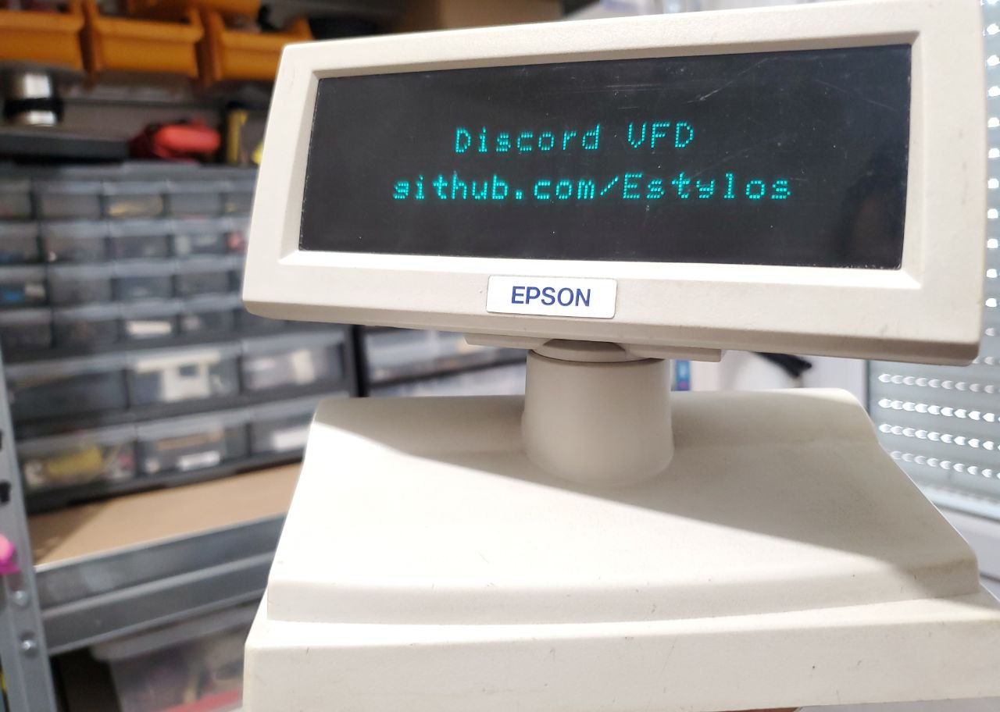
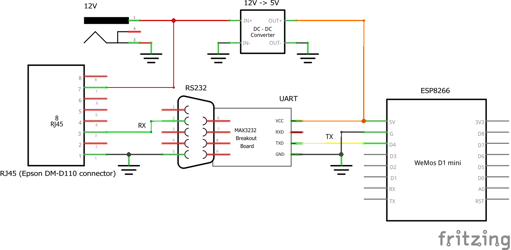

# VFD MQTT

Control a Vacuum Fluorescent Display (VFD) with an ESP8266 (Wemos D1 Mini programmed with PlatformIO) acting as an MQTT client. A Python script (MQTT client too) allows the integration of Discord and to send messages to the screen.

## The display

The VFD is a simple Epson DM-D110 (used mainly with cash registers). It communicates in RS232 and can be powered with a 12V power supply. Its baudrate (and more generally the RS232 configuration) can be adjusted using the DIP switches present on its PCB. Its technical documentation (accessible without too much difficulty on the internet) specifies the different configurations for the different baudrates. In my case I set it to the maximum, ie 115200 baud.

The screen uses Epson's ESC/POS command set (like many non-EPSON VFDs!). Once again, the documentation of the command set is easily found on the internet. Thanks to it, you can control the blanking of the screen, the position of the cursor, the brightness, the code page to use, the scrolling...
The characters are sent directly by their number in the Windows-1252 code page (in my configuration; by default it is PC437). 

## The circuit

| RJ45 DM-D110 connector | RS232 signal |
| ---------------------- | ------------ |
| 1                      | GND          |
| 2                      | TX           |
| 3                      | RX           |
| 4                      | DSR          |
| 5                      | DTR          |
| 6                      | GND          |
| 7                      | VCC          |
| 8                      | GND          |

The VFD is powered at 12V, and its RS232 signals are converted to UART for use with the ESP8266. I chose to connect only the RX line which is the only one necessary for the operation of the screen. We use pin D4 of the WeMos in order to use the 2nd hardware UART link (Serial1) and thus keep the 1st serial link for the monitor.
This circuit is easily made on perfboard.

## Operating

An MQTT server (mosquitto on a remote server) manages the communication. When the Discord ".write" command with text is sent (not exceeding 40 characters and not containing non-Windows-1252 characters), the special characters in the message are encoded by the Python script with [percent encoding](https://en.wikipedia.org/wiki/Percent-encoding) (character % followed by the number of the character in the Windows-1252 table). This choice is made because special characters are sent in UTF-8 by default, and can be stored on 1, 2 or 3 bytes, which makes it much more complicated to handle with the ESP8266.
The message is published by the python script in the MQTT channel "vfd/message", to which the ESP8266 is subscribed. As soon as a new message is sent, the VFD clears its screen, and the data is processed and displayed byte by byte.

Having chosen MQTT as the messaging protocol allows the screen to be connected to anything. We can imagine a Python scipt that sends Tweets to the screen, or displays the followers of the latest ultra trendy TikTok account (wow!!).

## Related projects

- [playfultechnology/arduino-VFD-RS232](https://github.com/playfultechnology/arduino-VFD-RS232)
- [iooner : Epson VFD hack - ESP8266](https://iooner.io/epson-vfd-hack/)